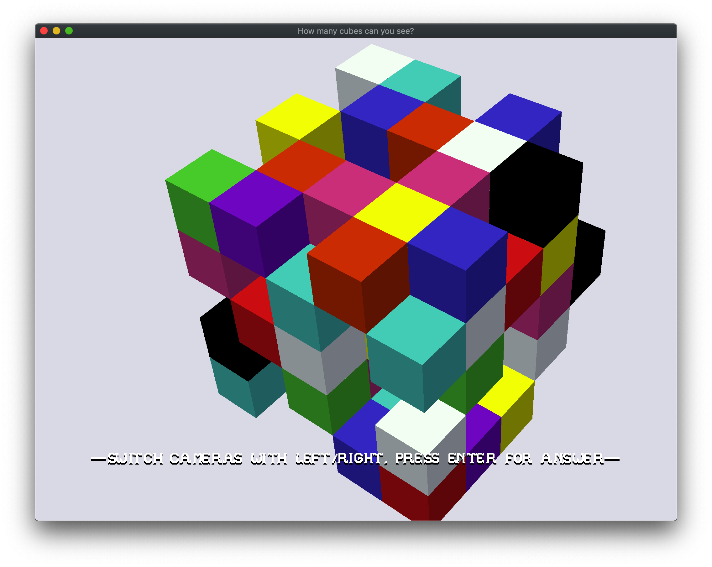

# How many cubes can you see?

Author: Haomin Wang (haominw)

Design: Given a 3D irregular cube, count the number of cubes you can explicitly see. 

Screen Shot:

How To Play:

Press LEFT/RIGHT to switch between cameras.
After counting, press RETURN to verify your answer.
Make sure you count each cube only once.
I personally counted from top to bottom, level by level.

Sources:
I created all the 3d assets by myslef using Blender 2.80.

This game was built with [NEST](NEST.md).
